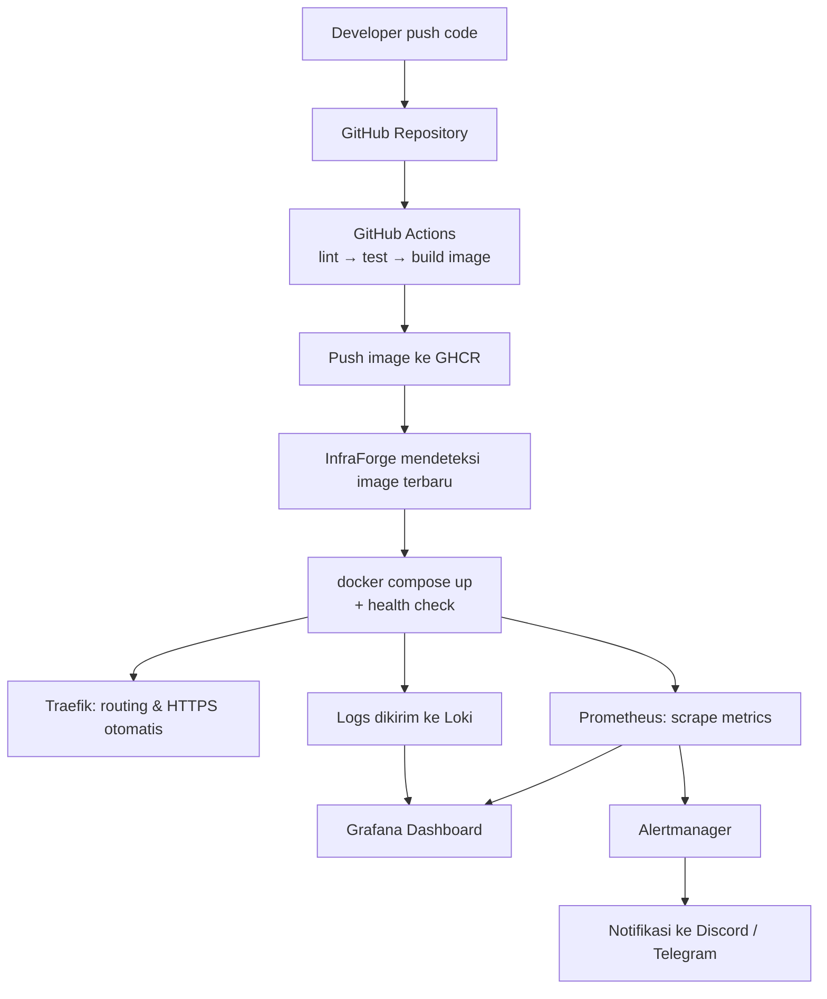
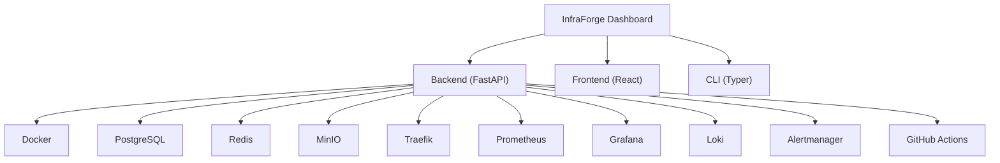

# InfraForge

**Platform DevOps self-hosted open source** untuk membangun, mendeploy, memonitor, dan mengelola aplikasi semuanya dari satu dashboard terpusat.

> Bukan sekadar "dashboard Docker". InfraForge adalah **Internal Developer Platform (IDP)** sederhana yang menyatukan tool-tool DevOps yang biasanya berdiri sendiri (Docker, Traefik, Prometheus, Grafana, Loki, GitHub Actions) menjadi satu alur kerja yang mulus.

---

## Daftar Isi

- [Masalah yang Diselesaikan](#masalah-yang-diselesaikan)
- [Cara Kerja](#cara-kerja)
- [Arsitektur](#arsitektur)
- [Fitur Utama](#fitur-utama)
- [Tech Stack](#tech-stack)
- [Struktur Folder](#struktur-folder)
- [Getting Started](#getting-started)
- [Roadmap](#roadmap)
- [Kenapa Namanya InfraForge?](#kenapa-namanya-infraforge)
- [License](#license)

---

## Masalah yang Diselesaikan

Tanpa InfraForge, deploy aplikasi biasanya melewati banyak tool yang terpisah:

```
GitHub → GitHub Actions → Docker Build → Docker Push → SSH ke VPS
   → docker compose pull → docker compose up
   → buka Grafana → buka Prometheus → buka Loki
   → cek logs → cek container → cek SSL → backup database
```

Dengan InfraForge, alurnya jadi:

```
Push Code → GitHub Actions → InfraForge → Deploy
```

Sisanya routing, HTTPS, monitoring, logging, alerting, backup ditangani otomatis oleh platform.

---

## Cara Kerja



1. **Push** -> developer push code ke GitHub.
2. **CI** -> GitHub Actions menjalankan lint, test, build image, lalu push ke GHCR.
3. **Deploy** -> InfraForge menarik image terbaru dan menjalankan `docker compose up` beserta health check.
4. **Routing** -> Traefik otomatis membuat routing dan HTTPS untuk domain aplikasi.
5. **Observability** -> Prometheus mengambil metric, Loki mengumpulkan log, semuanya tampil di Grafana.
6. **Alerting** -> Alertmanager mengirim notifikasi ke Discord/Telegram saat CPU tinggi, RAM penuh, atau container mati.

---

## Arsitektur



---

## Fitur Utama

| Kategori | Detail |
|---|---|
| **Deployment** | Deploy aplikasi hanya dengan beberapa klik |
| **Container Management** | Start, stop, restart, delete, view logs |
| **Monitoring** | CPU, RAM, Disk, Docker, Network, Uptime |
| **Logging** | Lihat log seluruh container dari satu tempat |
| **Project Management** | Satu server bisa kelola banyak project sekaligus |
| **Authentication** | JWT-based authentication |
| **Backup** | Backup database & file ke MinIO |
| **Dashboard** | Ringkasan container, resource usage, deployment history, alerts |

---

## Tech Stack

**Language**


**Backend**


**Frontend**


**Database**


**Cache**


**Reverse Proxy**


**SSL**


**Container**


**Container Registry**


**CI/CD**


**Monitoring**


**Logging**


**Alerting**


**Object Storage**


**Documentation**


**Testing**


**API Testing**


**CLI**


**DNS**


---

## Struktur Folder

```
InfraForge/
├── backend/          # FastAPI app (api, core, models, services, dst)
├── frontend/         # React app
├── infrastructure/   # Config Traefik, Postgres, Redis, MinIO, Prometheus, Grafana, Loki, dst
├── cli/              # CLI berbasis Typer
├── docs/             # Dokumentasi tambahan
├── .github/workflows # CI/CD pipelines
└── docker-compose.yml
```

---

## Getting Started

```bash
git clone https://github.com/Varaaa-arch/InfraForge.git
cd InfraForge
cp .env.example .env
docker compose up -d
```

> Setup lengkap masih dalam pengembangan, instruksi detail akan ditambahkan seiring progress.

---

## Kenapa Namanya InfraForge?

- **Infra** = Infrastructure
- **Forge** = menempa, membangun sesuatu yang kuat

> *"Tempat untuk membangun, mengelola, dan mengoperasikan infrastruktur aplikasi."*

Nama ini sengaja dibuat fleksibel saat project berkembang ke arah Kubernetes, GitOps, atau multi-cloud, nama **InfraForge** tetap relevan.

---

## License

Lisensi project ini akan ditentukan segera lihat file `LICENSE` untuk detail terbaru.